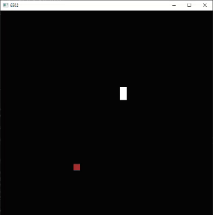
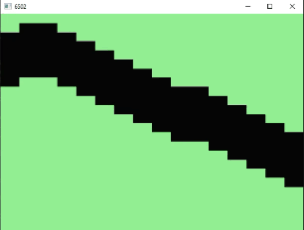

```
 || || || || || || || || || || || || || || || || || || || ||
 ___________________________________________________________
|                                                           |
|                     MOS 6502AD                            |
|                                                           |
|                     4585     S                            |
|___________________________________________________________|
 || || || || || || || || || || || || || || || || || || || ||
```

<br>
Émulateur du microprocesseur 6502 en C++ avec rendu graphique via DirectX 11. Fait pour mon apprentissage, il peut servir de base pour développer un émulateur NES.
<br>

**Ressources :**

- [Le CPU 6502-6510](https://www.youtube.com/playlist?list=PL7y5eRcbTLl8qNVNcX9HuJFo7TBwInXWC) (en français)  
- [Visual Transistor-level Simulation of the 6502 CPU](http://visual6502.org/welcome.html)  
- [Easy 6502](https://skilldrick.github.io/easy6502/)
- [6502 Documentation](http://6502.org/users/obelisk/6502/)  
- [Writing an NES Emulator in Rust](https://bugzmanov.github.io/nes_ebook/)

**Modes d'adressage :**  
- [Addressing Modes on 6502.org](http://6502.org/users/obelisk/6502/addressing.html)  
- [Addressing Modes on NesDev](https://www.nesdev.org/obelisk-6502-guide/addressing.html)  

**Codes opération (Opcodes) :**  
- [Opcodes sur Oxyron](https://www.oxyron.de/html/opcodes02.html)  
- [Opcodes sur NesDev](https://www.nesdev.org/obelisk-6502-guide/reference.html)

Testé avec :

- [Snake](https://skilldrick.github.io/easy6502/#snake)<br>


- [Animation](https://skilldrick.github.io/easy6502/simulator.html)<br>
